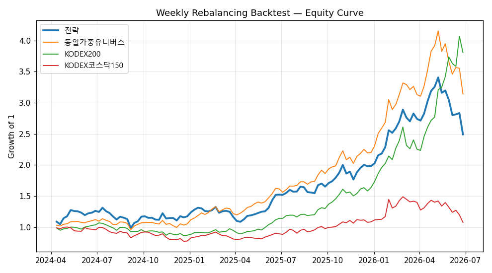

# AI Berkshire 주간 리밸런싱 — 백테스트 (Phase 2)

> **기간** 2024-04-01 ~ 2026-06-27 · 주간(W-FRI) · 116주 · 평균보유 12.0종

> **팩터** 퀄리티(ROE·영업이익률·순이익률·부채비율역) + 가치(earnings_yield·book_yield) · 가치:퀄리티 50:50

> **비용** 수수료 0.015% + 슬리피지 0.10% (편도) + 매도세 0.18%

> ⚠️ **point-in-time**: 회계연도말+공시시차 90일 후 재무만 사용(룩어헤드 차단). 컨센 상승여력·배당은 과거시점 확보 불가로 백테스트 제외. **투자권유 아님.**

## 1. 성과 요약

| 전략/벤치 | 누적수익 | CAGR | 변동성 | Sharpe | MDD | 주간승률 |
|---|--:|--:|--:|--:|--:|--:|
| **전략** | +149.1% | +50.6% | 32.5% | 1.56 | -26.9% | 60% |
| 동일가중유니버스 | +214.1% | +67.0% | 28.8% | 2.33 | -24.4% | 64% |
| KODEX200 | +280.9% | +82.1% | 28.9% | 2.84 | -19.2% | 65% |
| KODEX코스닥150 | +7.7% | +3.4% | 29.5% | 0.11 | -27.7% | 52% |

## 2. 연도별 수익률

| 연도 | 전략 | 동일가중유니버스 | KODEX200 | KODEX코스닥150 |
|---|--:|--:|--:|--:|
| 2024 | +17.4% | +5.4% | -12.9% | -22.3% |
| 2025 | +68.9% | +108.8% | +88.0% | +39.6% |
| 2026 | +25.6% | +42.8% | +132.7% | -0.8% |

## 3. 보유 빈도 상위 (선별 단골)

| 종목 | 선택 주수 | 비율 |
|---|--:|--:|
| 종근당(185750) | 116 | 100% |
| 풍산(103140) | 116 | 100% |
| 비츠로셀(082920) | 116 | 100% |
| 가온전선(000500) | 107 | 92% |
| 삼성SDI(006400) | 104 | 90% |
| 동진쎄미켐(005290) | 97 | 84% |
| 제룡전기(033100) | 81 | 70% |
| 삼성전자(005930) | 80 | 69% |
| 솔브레인(357780) | 79 | 68% |
| SK하이닉스(000660) | 64 | 55% |
| 대웅제약(069620) | 57 | 49% |
| 동성화인텍(033500) | 56 | 48% |
| 한미반도체(042700) | 52 | 45% |
| 휴젤(145020) | 52 | 45% |
| 산일전기(062040) | 44 | 38% |

## 4. 한계

- **데이터 구간 짧음(~2.25년)**: 네이버 연간재무 4개년 한계 → FY2023 공시 이후만 point-in-time 가능. 더 긴 백테스트는 DART 시점데이터 필요(Phase 2.1).
- **컨센·배당 팩터 제외**: 과거시점 확보 불가. 즉 본 백테스트는 '재구성 가능한 가치·퀄리티'만 검증(= Phase 1 발견 #1의 '컨센 노이즈 제거' 버전).
- **유동성 스크린 해제**(과거 거래대금 미수집), 생존편향(현 유니버스 기준) 잔존.
- 비용·슬리피지는 가정치. 세금·체결지연 실제와 다를 수 있음. **백테스트 ≠ 실전.**

---
*AI Berkshire quant Phase 2 — `python quant/run.py backtest`. 투자권유 아님.*