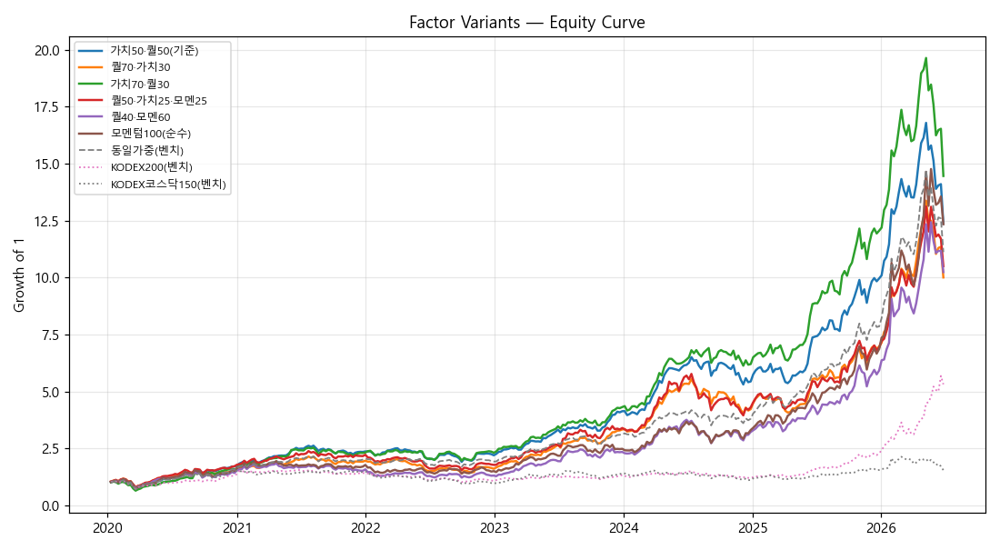

# AI Berkshire 주간 리밸런싱 — 팩터 A/B 비교 (Phase 2.1 — 장기 다레짐(DART 재무))

> **기간** 2020-01-03 ~ 2026-06-27 · 주간 · 338주 · 동일 데이터/비용/캡으로 팩터 조합만 변경

> 재무 = **DART 정본 다년(FY2017~2025)** + 주식수환산 eps/bps. 2022 둔화·2023 반도체적자·2024~26 호황을 모두 포함. **투자권유 아님.**

## 1. 성과 비교 (CAGR 순)

| 순 | 전략/벤치 | 누적 | CAGR | 변동성 | Sharpe | MDD | 승률 |
|--:|---|--:|--:|--:|--:|--:|--:|
| 1 | 가치70·퀄30 | +1346.2% | +50.8% | 27.8% | 1.83 | -37.9% | 64% |
| 2 | **가치50·퀄50(기준)** | +1136.7% | +47.2% | 26.2% | 1.81 | -35.6% | 64% |
| 3 | 모멘텀100(순수) | +1134.4% | +47.2% | 34.7% | 1.36 | -35.9% | 58% |
| 4 | 동일가중유니버스 _(벤치)_ | +1011.8% | +44.9% | 26.2% | 1.71 | -36.2% | 65% |
| 5 | 퀄50·가치25·모멘25 | +950.1% | +43.6% | 29.6% | 1.47 | -35.0% | 59% |
| 6 | 퀄40·모멘60 | +924.1% | +43.0% | 33.2% | 1.29 | -33.8% | 58% |
| 7 | 퀄70·가치30 | +900.7% | +42.5% | 27.0% | 1.58 | -35.0% | 64% |
| 8 | KODEX200 _(벤치)_ | +431.4% | +29.3% | 23.8% | 1.23 | -34.3% | 57% |
| 9 | KODEX코스닥150 _(벤치)_ | +54.3% | +6.9% | 26.4% | 0.26 | -37.5% | 54% |

## 2. 변형별 연도 수익률

| 전략 | 2020 | 2021 | 2022 | 2023 | 2024 | 2025 | 2026 | 종합CAGR |
|---|--:|--:|--:|--:|--:|--:|--:|--:|
| 가치50·퀄50(기준) | +70.7% | +38.8% | -7.2% | +88.1% | +31.6% | +83.1% | +24.1% | +47.2% |
| 퀄70·가치30 | +52.5% | +28.5% | -18.0% | +107.4% | +26.8% | +65.0% | +43.6% | +42.5% |
| 가치70·퀄30 | +57.6% | +47.1% | -0.4% | +86.8% | +43.7% | +94.4% | +19.9% | +50.8% |
| 퀄50·가치25·모멘25 | +71.3% | +29.6% | -20.0% | +91.2% | +26.7% | +60.9% | +51.7% | +43.6% |
| 퀄40·모멘60 | +42.0% | +11.2% | -17.2% | +79.3% | +37.4% | +83.8% | +72.9% | +43.0% |
| 모멘텀100(순수) | +50.8% | +17.7% | -15.3% | +65.2% | +33.2% | +107.6% | +79.8% | +47.2% |
| _동일가중(벤치)_ | +55.7% | +31.8% | -6.3% | +63.2% | +21.1% | +106.7% | +41.5% | +44.9% |
| _KODEX200(벤치)_ | +31.3% | +7.5% | -24.1% | +24.9% | -9.1% | +88.0% | +132.7% | +29.3% |
| _KODEX코스닥150(벤치)_ | +46.3% | +2.6% | -35.7% | +45.2% | -20.6% | +39.6% | -0.8% | +6.9% |

## 3. 한계

- DART 12월결산 가정·연결(CFS) 우선. 일부 종목 corp_code/연결 결측 시 해당주 제외.
- 가치팩터 eps/bps는 **현재 주식수 고정 환산**(과거 증자·분할 미반영, 근사).
- 생존편향(현 유니버스)·신규상장종목은 상장 전 자동 제외.
- **백테스트 ≠ 실전.** 비용·슬리피지는 가정치.

---
*AI Berkshire quant — `python quant/run.py backtest-long`. 투자권유 아님.*