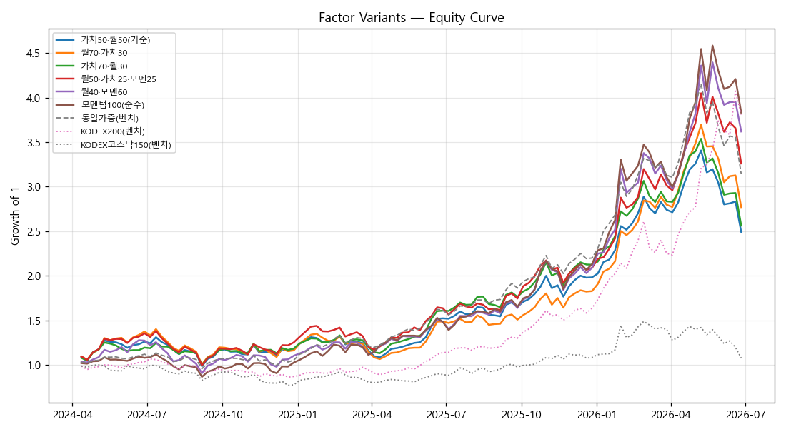

# AI Berkshire 주간 리밸런싱 — 팩터 A/B 비교 (Phase 2.5)

> **기간** 2024-04-01 ~ 2026-06-27 · 주간 · 116주 · 동일 데이터/비용/캡으로 팩터 조합만 변경

> 모멘텀 = 26주(6개월) 수익률(point-in-time). 컨센·배당 제외(과거 확보불가). **투자권유 아님.**

## 1. 성과 비교 (CAGR 순)

| 순 | 전략/벤치 | 누적 | CAGR | 변동성 | Sharpe | MDD | 승률 |
|--:|---|--:|--:|--:|--:|--:|--:|
| 1 | 모멘텀100(순수) | +283.1% | +82.6% | 38.6% | 2.14 | -22.5% | 61% |
| 2 | KODEX200 _(벤치)_ | +280.9% | +82.1% | 28.9% | 2.84 | -19.2% | 65% |
| 3 | 퀄40·모멘60 | +261.9% | +78.0% | 39.9% | 1.95 | -28.9% | 59% |
| 4 | 퀄50·가치25·모멘25 | +226.1% | +69.9% | 36.2% | 1.93 | -28.0% | 57% |
| 5 | 동일가중유니버스 _(벤치)_ | +214.1% | +67.0% | 28.8% | 2.33 | -24.4% | 64% |
| 6 | 퀄70·가치30 | +177.1% | +57.9% | 34.7% | 1.67 | -28.3% | 61% |
| 7 | 가치70·퀄30 | +156.3% | +52.5% | 31.2% | 1.68 | -27.6% | 62% |
| 8 | **가치50·퀄50(기준)** | +149.1% | +50.6% | 32.5% | 1.56 | -26.9% | 60% |
| 9 | KODEX코스닥150 _(벤치)_ | +7.7% | +3.4% | 29.5% | 0.11 | -27.7% | 52% |

## 2. 변형별 연도 수익률

| 전략 | 2024 | 2025 | 2026 | 종합CAGR |
|---|--:|--:|--:|--:|
| 가치50·퀄50(기준) | +17.4% | +68.9% | +25.6% | +50.6% |
| 퀄70·가치30 | +16.3% | +57.2% | +51.5% | +57.9% |
| 가치70·퀄30 | +18.5% | +79.3% | +20.6% | +52.5% |
| 퀄50·가치25·모멘25 | +25.3% | +66.7% | +56.1% | +69.9% |
| 퀄40·모멘60 | +10.3% | +89.4% | +73.1% | +78.0% |
| 모멘텀100(순수) | +2.7% | +107.5% | +79.8% | +82.6% |
| _동일가중(벤치)_ | +5.4% | +108.8% | +42.8% | +67.0% |
| _KODEX200(벤치)_ | -12.9% | +88.0% | +132.7% | +82.1% |
| _KODEX코스닥150(벤치)_ | -22.3% | +39.6% | -0.8% | +3.4% |

## 3. 한계

- 단일 레짐(2024~26 AI 불장) 2.25년 — 모멘텀 우위는 이 구간 특성일 수 있음(레짐 의존).
- 모멘텀 추가는 회전율·비용↑. 본 비용가정(편도 0.115%+매도세) 하 순수익 기준.
- **백테스트 ≠ 실전.** 더 긴 다레짐 검증(DART, Phase 2.1) 권장.

---
*AI Berkshire quant Phase 2.5 — `python quant/run.py compare`. 투자권유 아님.*